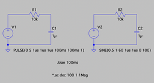
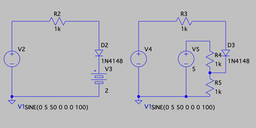
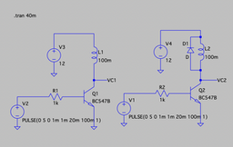
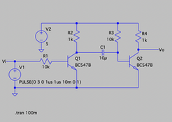
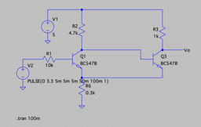
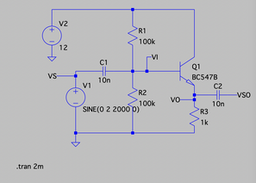
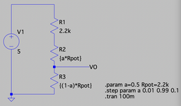

# 101 circuit simulations with LTSpice

(A work in progress...)

| No. | Image | Description |
|---|---|---|
| 1 | [][1] | [Simple RC circuit][1] (transient and ac simulation)|
| 2 | [][2] | [Diode Clipper][2]|
| 3 | [][3] | [Flyback diode][3]|
| 4 | [][4] | [Transistor pulse generator][4]|
| 5 | [][5] | [Transistor Schmitt trigger][5]|
| 6 | [][6] | [Emitter Follower][6]|
| 7 | [][7] | [Potentiometer resistor divider][7]|

[1]: https://github.com/mkvenkit/ltspice101/tree/main/simple_rc
[2]: https://github.com/mkvenkit/ltspice101/tree/main/diode_clipper
[3]: https://github.com/mkvenkit/ltspice101/tree/main/flyback_diode
[4]: https://github.com/mkvenkit/ltspice101/tree/main/tr_pulse_gen
[5]: https://github.com/mkvenkit/ltspice101/tree/main/tr_schmitt_trigger
[6]: https://github.com/mkvenkit/ltspice101/tree/main/emitter_follower
[7]: https://github.com/mkvenkit/ltspice101/tree/main/resistor_divider